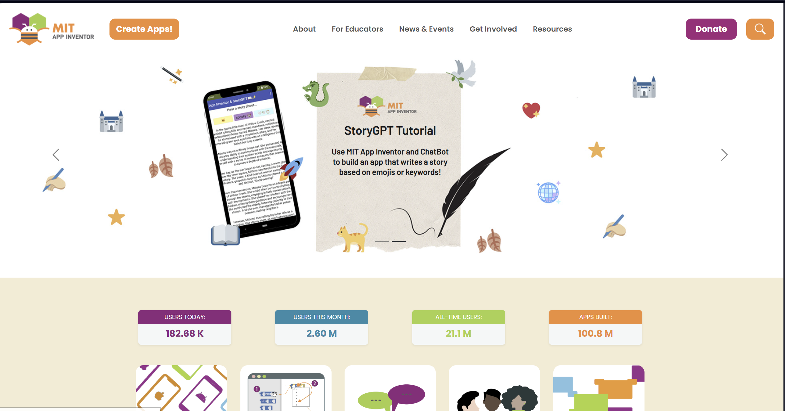
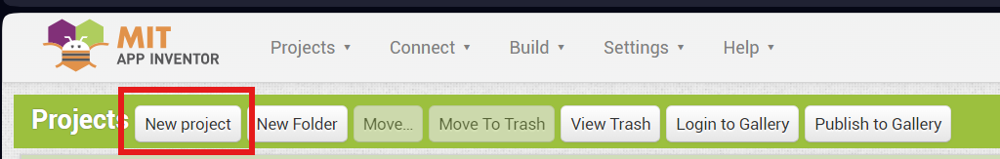
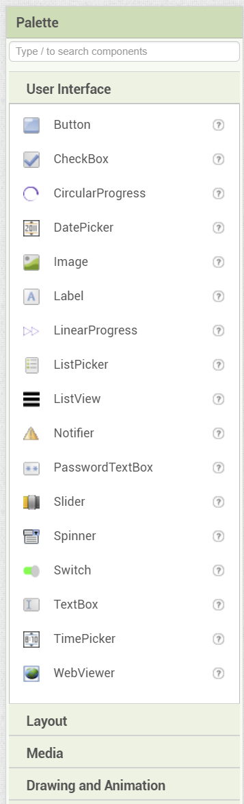
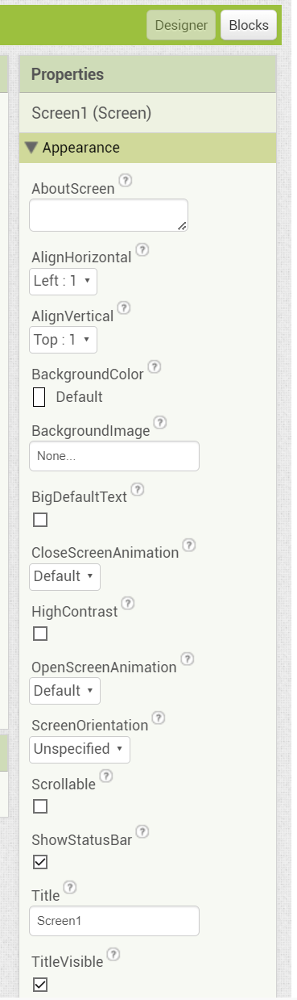
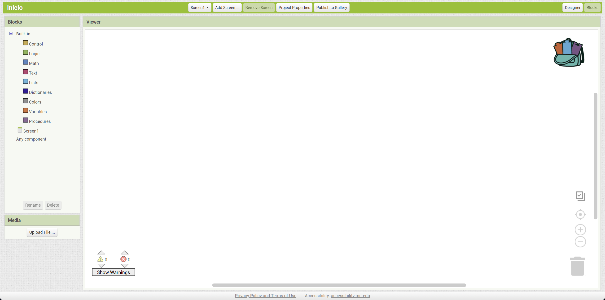
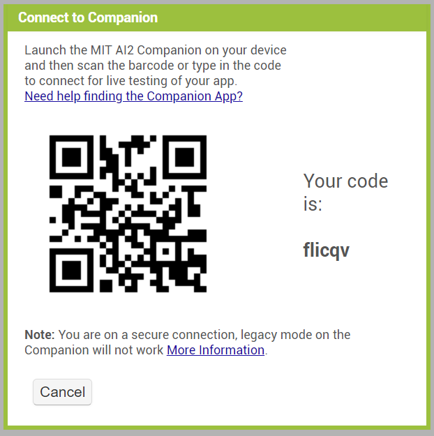

---
# **📌 Introducción a App Inventor**
## **¿Qué es App Inventor?**
**App Inventor** es una plataforma de desarrollo de aplicaciones para dispositivos **Android** creada por el **MIT (Massachusetts Institute of Technology)**. Su propósito es permitir que cualquier persona, sin conocimientos avanzados de programación, pueda crear **aplicaciones móviles** mediante una interfaz de desarrollo **visual y basada en bloques**.

### **🎯 Propósito de App Inventor**
✅ Facilitar la enseñanza de programación a principiantes.  
✅ Permitir la creación de aplicaciones sin necesidad de escribir código.  
✅ Fomentar la creatividad y resolución de problemas en entornos educativos.  
✅ Crear aplicaciones funcionales para dispositivos Android de manera rápida.  

📌 **Logo de AppInvnetor:**  

  

# **📌 Primeros Pasos en App Inventor**
Para comenzar a desarrollar una aplicación en **App Inventor**, sigue estos pasos:

## **1️⃣ Acceder a App Inventor**
1. Abre un navegador web y ve a la página oficial:  
   🔗 [**appinventor.mit.edu**](https://appinventor.mit.edu/)
2. Haz clic en **"Create Apps!"**.
3. Inicia sesión con una cuenta de **Google**.

📌 **Pantalla inicial pagina de AppInventor:**   
<!-- Pantalla inicial de App Inventor -->

  

## **2️⃣ Crear un Nuevo Proyecto**
1. Haz clic en **"Start New Project"**.
2. Escribe un **nombre para tu proyecto** (Ejemplo: `MiPrimeraApp`).
3. Presiona **"OK"**.

📌 **Nuevo proyecto:**  

<!-- Crear nuevo proyecto -->

  

## **3️⃣ Interfaz de App Inventor**
La interfaz de App Inventor tiene tres partes principales:

| Sección | Descripción |
|---------|------------|
| **Diseñador (Designer)** | Permite arrastrar y soltar componentes visuales para la app. |
| **Editor de Bloques (Blocks)** | Define la lógica de la aplicación mediante bloques. |
| **Emulador o Conexión con el Teléfono** | Permite probar la app en tiempo real. |

## **4️⃣ Interfaz de diseñador de apps**
1. **Arrastra componentes** al área de diseño (botones, etiquetas, imágenes, etc.).

📌 **Sección de componentes:**
<!-- Crear nuevo proyecto -->

  

2. Personaliza las propiedades de los elementos (color, tamaño, texto).
   
📌 **Sección de configuración de componentes:**

  

## **5️⃣ Programar con Bloques**
1. Cambia a la pestaña **Blocks**.
2. Arrastra **bloques de control** y **eventos** (Ejemplo: "Cuando se presione el botón").
3. Conéctalos para definir el comportamiento de la app.

📌 **Seccion de bloques:**  

<!-- Bloques de programación -->

  

# **📌 Métodos para Probar la Aplicación en un Celular**
Una vez que has diseñado y programado tu aplicación, puedes probarla en tu teléfono de diferentes maneras:

## **1️⃣ Método 1: Usar la App "MIT AI2 Companion" (Recomendado)**
- **Descarga la aplicación** **MIT AI2 Companion** desde Google Play.
- En App Inventor, haz clic en **"Connect" > "AI Companion"**.
- Escanea el **código QR** o introduce el **código de conexión**.
- La app se ejecutará en el teléfono en **tiempo real**.

📌 **Código QR de ejemplo en la pantalla de conexión**  

  

✅ **Ventajas:**  
✔ No requiere instalar la app en el celular.  
✔ Se pueden hacer pruebas en tiempo real.  

# **📌 Conclusión**
App Inventor es una herramienta poderosa para la creación de aplicaciones **sin necesidad de programar código complejo**. Con su **interfaz visual y bloques de programación**, es una excelente opción para aprender desarrollo móvil de manera sencilla.

🚀 **¡Ahora puedes empezar a crear tus propias aplicaciones Android!**  
---
